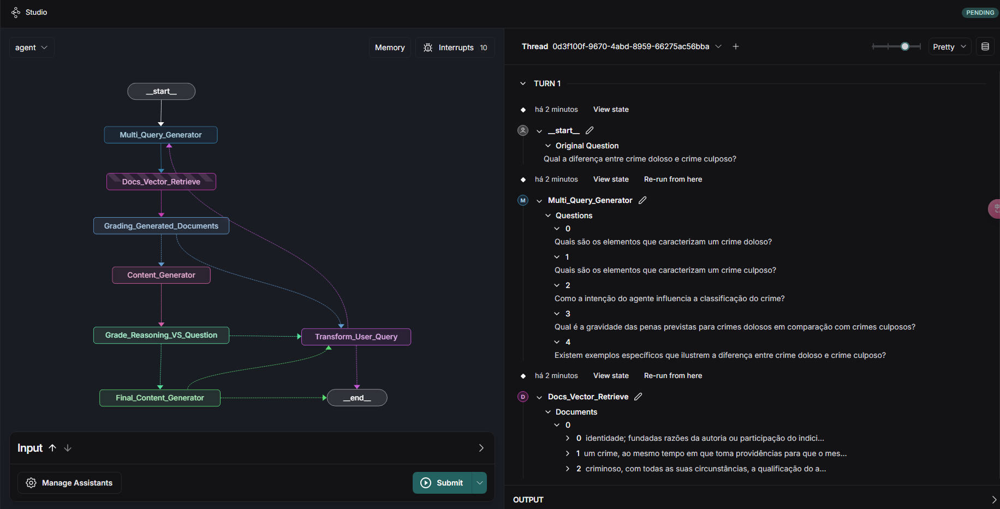

## 📑 Overview
JurisRAG is an advanced Retrieval-Augmented Generation (RAG) system with self-reflection, specifically adapted for the legal domain. Using a multi-agent architecture, the system breaks down complex legal questions, retrieves relevant documents, evaluates the quality of retrieved information, and generates accurate responses with hallucination verification.

## 🔍 Architecture
The system implements a specialized workflow that includes:

- Multi_Query_Generator: Decomposes complex legal questions into multiple sub-queries to optimize the retrieval of relevant information.
- Docs_Vector_Retrieve: Retrieves relevant legal documents from a vectorized knowledge base.
- Grading_Generated_Documents: Evaluates the quality and relevance of retrieved documents in relation to the original queries.
- Content_Generator: Generates initial content based on approved documents.
- Grade_Reasoning_VS_Question: Evaluates whether the applied legal reasoning is adequate for the original question.
- Final_Content_Generator: Refines the content to produce the final response.
- Transform_User_Query: Reformulates or redirects the query when necessary.

## ⚙️ Technologies Used

- Python
- LangGraph
- LangGraph Studio
- LangChain
- Databricks Vectorsearch
- OpenAI API

## 🌟 Key Features

Intelligent Question Decomposition: Divides complex legal questions into simpler components to improve retrieval accuracy.
Document Quality Assessment: Filters retrieved legal documents based on relevance to the specific query.
Hallucination Verification: Implements mechanisms to detect and correct incorrect or fabricated information in generated responses.
Adaptive Workflow: Redirects queries or refines responses as needed throughout the process.

## 📷 Execution Flow

## 📋 Processing Flow

1 - The user submits a legal question.
2 - The system decomposes the question into multiple specific queries.
3 - Legal documents are retrieved for each query.
4 - Document quality is evaluated.
5 - An initial response is generated for each decomposed question based on approved documents.
6 - Legal reasoning is evaluated.
7 - If the reasoning is useful, a final response is generated based on approved reasoning.
8 - Otherwise, the query is transformed or redirected.

## 📈 Performance Evaluation
The system includes metrics to evaluate performance:

Response Accuracy: Comparison with reference answers.
Document Relevance: Rate of relevant documents retrieved.
Hallucination Detection: Percentage of hallucinations correctly identified.
Processing Time: Total latency and latency per component.

## 🚀 How to Use

Clone this repository.

Create and activate a virtual environment:
python -m venv venv
source venv/bin/activate

Install dependencies:
pip install -e .
pip install --upgrade "langgraph-cli[inmem]"

Configure environment variables.

Launch LangGraph Server:
langgraph dev
